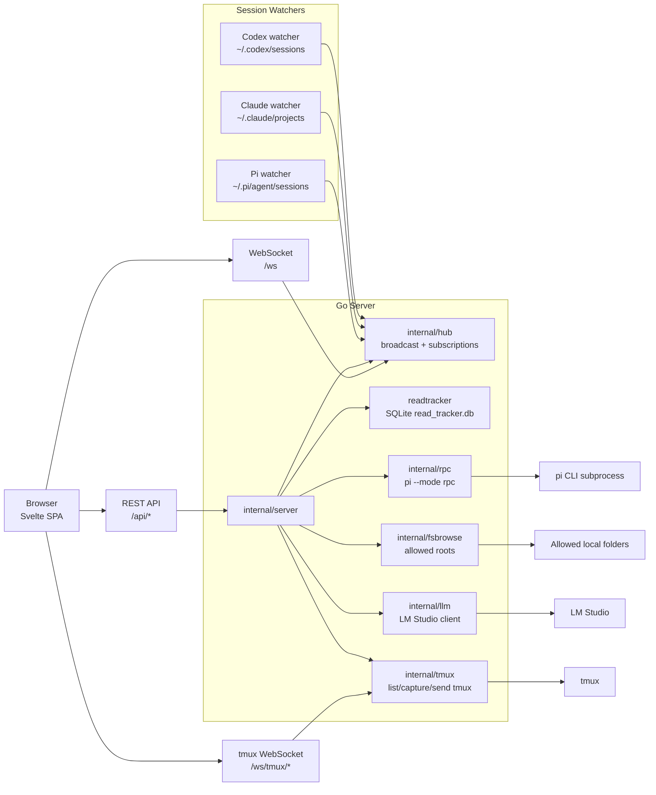

# Agent Reader

Agent Reader is a local-first web UI for reading and interacting with local AI agent sessions.

It watches session files produced by local agents, streams new events to the browser in real time, and provides a Go-backed bridge for features that need local machine access, such as RPC sessions, filesystem browsing, image upload, translation through LM Studio, and tmux session viewing.

## What it does

- Read and replay local agent session histories.
- Stream new session events live over WebSocket.
- Group, sort, and inspect sessions by project.
- Start and interact with Pi RPC sessions from the web UI.
- View Claude Code sessions in read-only mode.
- View Codex sessions in read-only mode.
- Browse and search allowed local folders for context insertion.
- Upload and view local images.
- Translate message content through a local LM Studio endpoint.
- Discover and open tmux sessions/windows in an embedded terminal-like UI.

## Supported session sources

| Source | Default path | Mode |
| --- | --- | --- |
| Pi Agent | `~/.pi/agent/sessions` | Read + RPC |
| Claude Code | `~/.claude/projects` | Read-only |
| Codex | `~/.codex/sessions` | Read-only |
| tmux | local `tmux` process | Live terminal view |

## Architecture



## Tech stack

### Backend

- Go
- `net/http`
- `gorilla/websocket`
- `fsnotify`
- `modernc.org/sqlite`

### Frontend

- Svelte 5
- Vite 6
- Tailwind CSS 4
- `marked`
- `xterm`
- `xterm-addon-fit`
- `@lucide/svelte`

## Repository structure

```text
.
├── cmd/server/                 # CLI entrypoint
├── internal/
│   ├── server/                 # HTTP, REST, WebSocket, static SPA host
│   ├── hub/                    # WebSocket clients and event broadcasting
│   ├── watcher/                # Pi, Claude, and Codex session watchers
│   ├── jsonl/                  # JSONL decoders and normalizers
│   ├── rpc/                    # Pi RPC subprocess bridge
│   ├── readtracker/            # SQLite unread/read tracking
│   ├── fsbrowse/               # Safe local filesystem browsing
│   ├── llm/                    # LM Studio client
│   └── tmux/                   # tmux discovery and live pane streaming
├── frontend/                   # Svelte SPA
├── docs/superpowers/           # Design specs and implementation plans
├── Makefile
└── go.mod
```

## Prerequisites

Required:

- Go 1.25+
- Node.js and npm
- A local Pi session directory at `~/.pi/agent/sessions`

Optional:

- `pi` CLI, required for RPC mode.
- Claude Code, if you want Claude session replay.
- Codex, if you want Codex session replay.
- `tmux`, if you want tmux session discovery and live viewing.
- LM Studio, if you want local translation.

## Configuration

Agent Reader accepts CLI flags and a simple `.env` file.

### CLI flags

```bash
./bin/server \
  -addr :8081 \
  -sessions ~/.pi/agent/sessions \
  -claude-projects ~/.claude/projects \
  -codex-sessions ~/.codex/sessions \
  -roots "$HOME/code,$HOME/projects"
```

| Flag | Description | Default |
| --- | --- | --- |
| `-addr` | HTTP listen address | `:8081` |
| `-sessions` | Pi Agent sessions directory | `~/.pi/agent/sessions` |
| `-claude-projects` | Claude Code projects directory | `~/.claude/projects` |
| `-codex-sessions` | Codex sessions directory | `~/.codex/sessions` |
| `-roots` | Comma-separated folders allowed for filesystem browsing | empty |

### `.env`

```env
ALLOWED_ROOT_FOLDERS=/Users/dt/code,/Users/dt/projects
LMSTUDIO_URL=http://localhost:1234/v1/chat/completions
LMSTUDIO_MODEL=local-model-name
```

`ALLOWED_ROOT_FOLDERS` enables the filesystem APIs. Without it, `/api/fs/*` is disabled.

## Development

### Install dependencies and run the backend for frontend development

The Vite dev server proxies `/api` and `/ws` to `http://localhost:8080`, so use the debug backend target when developing the frontend.

Terminal 1:

```bash
make run-debug
```

Terminal 2:

```bash
make frontend-dev
```

Then open the Vite dev URL shown in the terminal.

### Run frontend only

```bash
make frontend
```

### Build everything

```bash
make build
```

This installs frontend dependencies, builds the Svelte app into `internal/server/static/dist`, and builds the Go server binary to `bin/server`.

### Run production build locally

```bash
make run
```

By default, this starts the compiled server on `:8081`.

### Run as daemon

```bash
make daemon-start
make daemon-status
make daemon-stop
```

You can override the address:

```bash
ADDR=:8080 make daemon-start
```

Logs are written to:

```text
bin/server.log
```

The PID file is:

```text
bin/server.pid
```

### Run tests

```bash
make test
```

## API overview

### Sessions

| Endpoint | Description |
| --- | --- |
| `GET /api/sessions` | List sessions |
| `POST /api/sessions/create` | Create a new Pi RPC-backed session |
| `GET /api/sessions/unread` | Return unread session IDs |
| `GET /api/sessions/{id}` | Get session metadata |
| `POST /api/sessions/{id}/mark-read` | Mark a session as read |

### WebSocket

| Endpoint | Description |
| --- | --- |
| `GET /ws` | Stream session events to the browser |

Client messages include subscribe/unsubscribe style filters by session or project. Server messages carry normalized agent events.

### RPC

| Endpoint | Description |
| --- | --- |
| `POST /api/rpc/start` | Start Pi RPC for a session |
| `POST /api/rpc/stop` | Stop Pi RPC for a session |
| `POST /api/rpc/send` | Send a command to Pi RPC |
| `GET /api/rpc/get_state` | Get RPC state |
| `GET /api/rpc/get_commands` | Get available commands |
| `GET /api/rpc/get_models` | Get available models |
| `POST /api/rpc/set_model` | Set model |
| `POST /api/rpc/cycle_model` | Cycle model |
| `GET /api/rpc/status` | Get running RPC sessions |

### Filesystem browsing

Enabled only when allowed roots are configured.

| Endpoint | Description |
| --- | --- |
| `GET /api/fs/browse?path=...` | List directory contents |
| `GET /api/fs/search?root=...&query=...` | Search files/folders |
| `GET /api/fs/read?path=...` | Read a small file preview |

### Images

| Endpoint | Description |
| --- | --- |
| `POST /api/images/upload` | Upload an image |
| `GET /api/images/view` | View an uploaded image |

### Translation

| Endpoint | Description |
| --- | --- |
| `POST /api/translate` | Translate via the configured LM Studio client |

### tmux

| Endpoint | Description |
| --- | --- |
| `GET /api/tmux/sessions` | List local tmux sessions |
| `GET /api/tmux/sessions/{name}/windows` | List windows for a tmux session |
| `GET /ws/tmux/{name}` | Stream a tmux session/window to the browser |

The tmux backend polls `tmux capture-pane`, broadcasts changed pane content, and sends input back through `tmux send-keys`.

## Session behavior

### Pi sessions

Pi sessions are the primary interactive mode. The server can create a new JSONL session file, start a `pi --mode rpc --session <path>` subprocess, and bridge commands/responses between the browser and the local process.

### Claude Code sessions

Claude Code sessions are watched from the configured Claude projects directory and normalized into the same session list and WebSocket flow. These sessions are read-only in the UI.

### Codex sessions

Codex sessions are watched from the configured Codex sessions directory. The Codex decoder filters internal/subagent sessions and normalizes user-facing messages, function calls, and function outputs into the existing event model. These sessions are read-only in the UI.

### tmux sessions

Agent Reader can list local tmux sessions and open a modal terminal view. The frontend uses xterm.js; the backend uses `tmux list-sessions`, `tmux list-windows`, `tmux capture-pane`, and `tmux send-keys`.

## Security notes

Agent Reader is designed for local development use.

- Do not expose it directly to the public internet.
- The WebSocket origin check is permissive for local workflows.
- Filesystem browsing is restricted to configured allowed roots.
- RPC and tmux features can execute or interact with local processes.
- Treat the server as trusted local tooling.

## Troubleshooting

### `sessions directory ... no such file or directory`

Create or pass a valid Pi sessions directory:

```bash
mkdir -p ~/.pi/agent/sessions
make run
```

Or pass a custom path:

```bash
./bin/server -sessions /path/to/sessions
```

### Frontend dev server cannot call the backend

Make sure the backend is running on port `8080` when using Vite dev mode:

```bash
make run-debug
```

The Vite config proxies `/api` and `/ws` to `localhost:8080`.

### tmux sessions do not appear

Check that `tmux` is installed and that sessions exist:

```bash
tmux list-sessions
```

### Filesystem search/browse is disabled

Set allowed roots through `.env` or the `-roots` flag:

```env
ALLOWED_ROOT_FOLDERS=/Users/dt/code,/Users/dt/projects
```

### Translation does not work

Make sure LM Studio is running and the configured URL/model match your local server:

```env
LMSTUDIO_URL=http://localhost:1234/v1/chat/completions
LMSTUDIO_MODEL=your-model
```

## Project status

This project is actively evolving as a local web reader/control plane for agent sessions. Current focus areas include better session streaming, read-only support for multiple agent formats, and tighter tmux integration.
